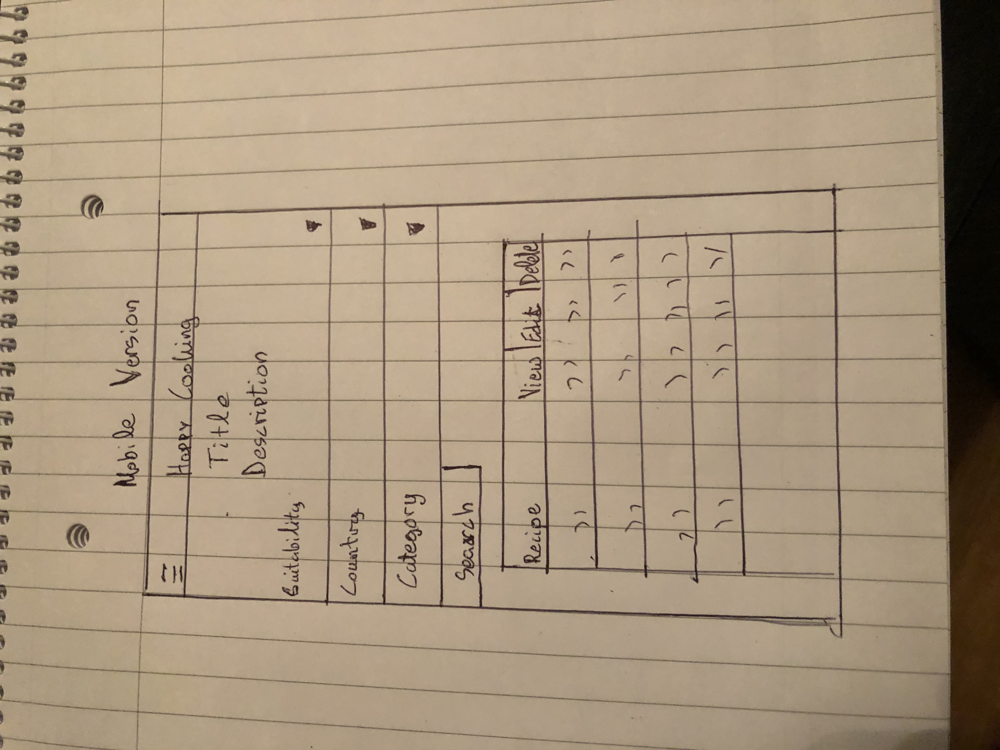
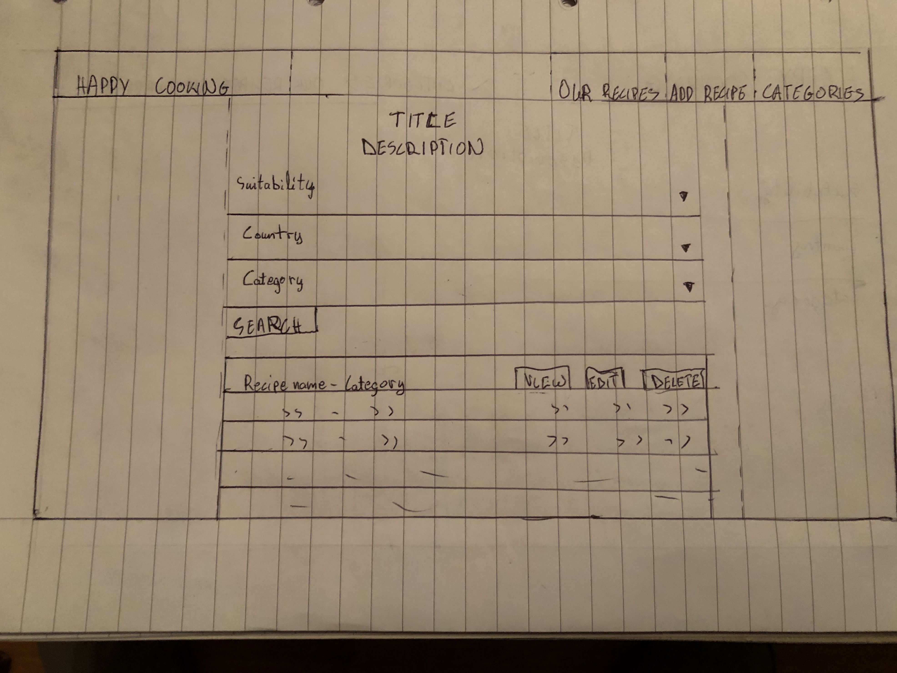

# Happy Cooking Webpage

Third Milestone Project: Data Centric Development - Code Institute

My Happy Cooking Webpage is an interactive webpage, which main purpose is to explore the world through a variety of recipes and to be able to allow the user to discover their passion about cooking. In addition it allows the user to manipulate the data and the recipes, by either crreating, reading, updating and deleting the recipes(CRUD).

## UX

My main purpose when creating the webpage was to ensure that it covers a wide range of recipes from all over the world that can be easily accessed and manipulated.

- As a user of the webpage I want to be able to view all the recipes that the owner of the webpage has provided by clicking a button in the home page.
- As a user I want to specify my search criteria and be able to get results for recipes that fit for vegans and vegeterians.
- As a user of the webpage I want to specify my search criteria and be able to get results for recipes from particular countries.
- As a user of the webpage I want to be able to search for specific recipes by category.(Appetisers, Starters, Main Courses, Desserts).
- As a user of the webpage I want to be able to insert my own recipes and save them to the webpage.
- As a user of the webpage I want to be able to edit the recipes that exist in the webpage by clicking a button and be able to save the updated recipes.
- As a user of the webpage I want to be able to delete the recipes that I do not like.
- As a user of the webpage I want to be able to see all the different categories of the recipes.
- As a user of the webpage I would also like to be able to create, read, update and delete the categories of the recipes.
- As a user of the webpage I want the webpage to have an easy access navigation bar that is clear for the purpose of each section.
- As a user I want to access the webpage from all differend types of divices (MObile Phones, Desktops,Laptops, Tablets, etc.)
- As a user of the webpage I want to be able to insert an image in when inserting or updating a recipe. 

## Wireframes 

## Features

- Happy Cooking is a webpage that allows the user to have an easy access and by clicking the "Happy Cooking" logo to always redirect to the home page.
- In the home page there are the recipes together with 3 buttons(View, Edit, Delete) where the user can manipulate the recipes.
- In the home page there are also 3 input fields together with a search button to be able to make the user specify the search by suitability(For Vegans or Vegeterians), country(Italy, Greece, Mexico, Thailand) and catecory(Appetisers, Starters, Main Courses, Desserts).
- There is also a navigation bar, created with [Materialise](https://materializecss.com/navbar.html) with 3 sections on the right top corner (Our Recipes, Add your Recipe, Categories):
1. By clicking "Our Recipes" logo it will always redirect you to the home page where all the recipes are stored.
2. By clicking "Add Your Recipe" logo it will redirect you to the page where you can add your recipe.
3. By clicking "Categories" logo it will redirect you to the page where all the categories are stored and there you can add, edit and delete a category.
- The webpage is also using a slide-out side-navigation bar in order to make it more easy to access by mobile phone [Materialise](https://materializecss.com/mobile.html).

## Features Left to be implemented

In the future i would like to add some links to social media and a registration form for new users.

## Technologies Used

- [Materialise](https://materializecss.com/) Used for styling of the webpage
- [Git](https://en.wikipedia.org/wiki/Git) Used for writting commands and inserting new documents in my webpage
- [Github]() Used to store my webpage for the users to have access to that and for my tutors and mentor to help me with my Milestone Project
- [Material-Icons]( https://material.io/resources/icons/?style=baseline) used for styling my input elements.
- [Jquery](https://en.wikipedia.org/wiki/JQuery) Used for manipulating the dom and add the elements to my project.
- [Heroku](https://en.wikipedia.org/wiki/Heroku) Used for the deployment of my project.

### Front-End
- [HTML](https://en.wikipedia.org/wiki/HTML5) Used for storing all my pages.
- [CSS](https://no.wikipedia.org/wiki/Cascading_Style_Sheets) Used for the styling of my webpage.

### Back-End

- [Flask 1.1.1](https://en.wikipedia.org/wiki/Flask_(web_framework)) A library used for the construction of the webpage
- [Python 3.6.8](https://en.wikipedia.org/wiki/Python_(programming_language)) This is the back-end programming language
- [MongoDB Atlas](https://en.wikipedia.org/wiki/MongoDB) To store all the data and collections of my webpage
- [PyMongo 3.8.0](https://api.mongodb.com/python/current/) MongoDB's API to interact with the data.
- [Jinja](https://en.wikipedia.org/wiki/Jinja_(template_engine)) Used for displaying elements from back-end to front0end.
- [BSON ObjectId](https://en.wikipedia.org/wiki/BSON) Used for creating "id's" in the Mongo database.

## Testing

- For the potencial users of my webpage that want to be able to see the recipes by clicking a button I have created a view button from Materialise and is triggered in my view_recipe.html with jinja. 

- The search function that I used in my recipes.html allow the users to specify their search regarding their needs(Country. Category, Suitability). The elements are triggered with jinja and i used the [text index](https://docs.mongodb.com/manual/text-search/#example) function from MongoDB.

- All the recipes are tested for the CRUD functinality. I verify that a user can easily create,read, update and delete any of my recipes by clicking the appropriate buttons.You can check it manually:
1. Go to the "Add your Recipe" section. 
2. Fill in the form with ingredients, image of the recipe, category, ingredients, method of cooking, allergens etc.
3. Ensure that you fill up all the sections otherwise the validation form will send you a notification about that.
4. Submit your changes by clicking the add recipe button.
5. Check if you are redirected in the home page and if your recipe is there.
6. Click to view the recipe and make sure that all the fields display correctly.
7. Try deleting your recipe and check if it is removed from your recipes section.

- To check if the edit function is working in recipes:
1. Try pressing the edit button in one of the recipes.
2. Try change the fields and press the button edit recipe.
3. Check if you are redirected in the home page and press the view button to see if the recipe is edited.

- To check if the edit function is working in categories:
1. Try pressing the edit button in one of the categories.
2. Try change the fields and press the button edit category.
3. Check if you are redirected in the home page and check if the category is edited in the categories section.

- To check if the add category works in the categories field:
1. Go to the "Categories" section.
2. Fill in the form(Category name, Image Url).
3. Click the add category button and ensure that you are redirected in the home page and if your category is there.
4. Make sure that when adding a recipe the image of your new category displays next to each name.
5. Try deleting the category and check if it is deleted from the categories section.

- All the forms in the editcategory.html,addcategory.html,editrecipe.html,addrecipe.html have a validation form that is checked manually and working properly.

- The Navigation Bar that the webpage is using is tested for all the types of devices and is working properly.

- The styling of the webpage applies to all different types of devices and is tested manually.

- The site is tested in a variety of devices such as:Iphones(4 to 10),Samsung Galaxy,Ipads and Desktops.In addition it's tested to all the possible browsers:Chrome, Safari, Internet Explorer, FireFox and i assure that it is compatible and responsive.

The biggest problem I faced when creating this website was how to identify and implement the search functionality, which at the end it was a very interesting feature.

## deployment

My webpage is hosted deployed in Github directly from the master branch. The Live link of my webpage can be seen here:
    [Milestone-Project-3]()
 Also the whole project can be viewed here:
    [Bumper-Milestone-Project-3]()

In addition my project is deployed in Heroku and can be viewed here:    
    [Happy-Cooking]()

The website consists of:
1. A static folder with a css folder,which has a style.css file and a wireframes folder with 2 wireframe images. 
2. A templates folder with 9 html pages.
3. An app.py file where all the backend is stored.
4. A procfile for the deployment in Heroku.
5. A requirements.txt file
6. The README.md file of the webpage.

## Credits

### Content
The content in the whole project is written by me.

### Media 

All the wireframes of the webpage are created by me.

### Acknowledgements

I recieved inspiration from sites such as: 
    - [W3schools](https://www.w3schools.com/)
    - [Stackflow](https://stackoverflow.com/)
    - [Youtube](https://www.youtube.com/watch?v=dTN8cBDEG_Q&feature=youtu.be)
    - [MongoDB](https://docs.mongodb.com/manual/text-search/#example)
    - [Github](https://github.com/Code-Institute-Submissions/COOK-BOOK-4)

